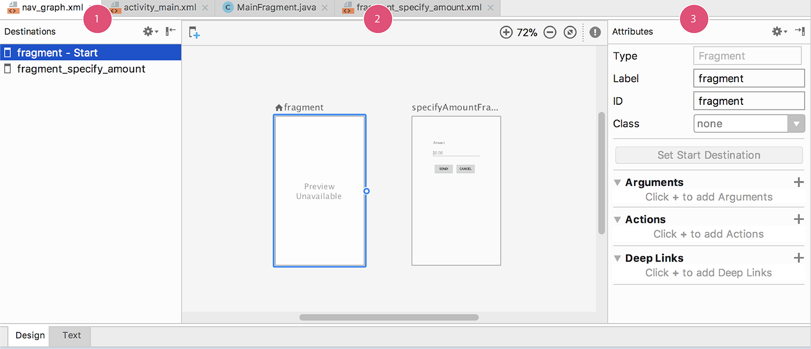
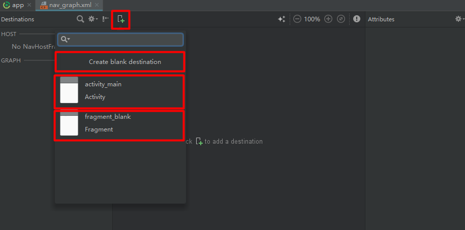

# 初识Navigation(Google为 单Activity+多Fragment 开发方式提供的官方支持)

<!-- TOC -->

- [初识Navigation(Google为 单Activity+多Fragment 开发方式提供的官方支持)](#初识navigationgoogle为-单activity多fragment-开发方式提供的官方支持)
    - [简单介绍下新的android支持包Jetpack](#简单介绍下新的android支持包jetpack)
    - [Jetpack中的Navigation(位于Architecture中)](#jetpack中的navigation位于architecture中)
    - [开始构建一个使用Navigation的项目](#开始构建一个使用navigation的项目)
        - [安装Android Studio 3.2版本](#安装android-studio-32版本)
        - [在项目中使用Navigation](#在项目中使用navigation)
            - [添加依赖](#添加依赖)
            - [创建Navigation资源文件](#创建navigation资源文件)
            - [开启Android Studio对Navigation的图形界面支持](#开启android-studio对navigation的图形界面支持)
            - [操作Navigation的图形化界面、熟悉Navigation使用](#操作navigation的图形化界面熟悉navigation使用)
            - [创建目标组件](#创建目标组件)
            - [连接到目标组件](#连接到目标组件)
                - [TODO](#todo)
            - [让APP通过Navigation来控制页面切换](#让app通过navigation来控制页面切换)
                - [设置一个起始组件](#设置一个起始组件)
                - [修改Activity来支持Navigation](#修改activity来支持navigation)
                - [将页面切换事件绑定在UI组件上](#将页面切换事件绑定在ui组件上)
                - [Navigation对菜单Menu的支持](#navigation对菜单menu的支持)
                - [Navigation的数据传递](#navigation的数据传递)
                - [嵌套的Navigation布局](#嵌套的navigation布局)
                - [Navigation的一些事件监听](#navigation的一些事件监听)
                - [Navigation对过渡动画的支持](#navigation对过渡动画的支持)

<!-- /TOC -->

## 简单介绍下新的android支持包Jetpack

Android Developer上面挂着Jetpack已经很久了。Jetpack是一组基于Android平台的库。Jetpack中包含四个层面的东西

* Foundation
  * AppCompat
  * Android KTX
  * Multidex
  * Test
* Architecture
  * Data Binding
  * Lifecycles
  * LiveData
  * Navigation
  * Paging
  * Room
  * ViewModel
  * WorkManager
* Behavior
  * Download manager
  * Media & playback
  * Notifications
  * Permissions
  * Sharing
  * Slices
* UI
  * Animation & transitions
  * Auto
  * Emoji
  * Fragment
  * Layout
  * Palette
  * TV
  * Wear Os by Google

Android Jetpack的具体介绍可以参看官方文档：
[Android Jetpack](https://developer.android.google.cn/jetpack/)

总结来说，以后Android将不再提供v4/v7/v13/v14等包的更新，统一到Jetpack库中，并以androidx.作为新的包开头。官方将通过Jetpack提供对Android各平台的兼容，并且Jetpack独立于Android各平台API进行更新，所以以后一般情况下我们只需要用最新的androidx.包就可以了，全部使用一套接口来兼容各平台。

## Jetpack中的Navigation(位于Architecture中)

今天我们体验下Jetpack中的Navigation库，Navigation库是官方为单Activity开发提供的官方支持。官方为Navigation开发了IDEA的插件可以使用图像化手段处理页面跳转关系；除了采用Bundle进行数据传输以外还提供了gradle插件帮助开发者使用图形化界面来传递参数；另外还提供了各个跳转之间的切换动画(Navigation中也提供了跳转到Activity的支持，但是暂时并没有提供从Activity跳转到其他页面的支持)。

## 开始构建一个使用Navigation的项目

### 安装Android Studio 3.2版本

要想在Android Studio中使用Navigation架构组件就必须使用Android Studio3.2或以上版本。而目前Android Studio3.2版本还处于Beta状态，所以为了提前体验新功能我们只能下载Beta版尝尝鲜 [Android Studio 3.2下载链接1](https://dl.google.com/dl/android/studio/ide-zips/3.2.0.22/android-studio-ide-181.4913314-windows.zip)。[Android Studio 3.2下载链接2](https://developer.android.google.cn/studio/preview/)。

> 下载安装后，导入配置文件时如果导入了老版本的Android Studio的配置文件，那么老版本中的项目列表将同样会显示在Android Studio3.2中。

### 在项目中使用Navigation

#### 添加依赖

安装好3.2版本的Android Studio之后，可以单独创建一个项目，也可以打开之前的项目。总之打开一个项目，并在其build.gradle文件中配置Navigation支持

```gradle
dependencies {
    implementation 'android.arch.navigation:navigation-fragment:1.0.0-alpha05'
    implementation 'android.arch.navigation:navigation-ui:1.0.0-alpha05'

    androidTestImplementation 'android.arch.navigation:navigation-testing:1.0.0-alpha05'
}
```

Navigation中的包命名方式已经改为以androidx.为包首，但是当前版本依然依赖有android support相关包。

#### 创建Navigation资源文件

在资源目录(res目录)中创建navigation文件夹，并在其中创建xml文件，并在其中创建文件nav_graph.xml。文件内容如下：

```xml
<?xml version="1.0" encoding="utf-8"?>
<navigation xmlns:android="http://schemas.android.com/apk/res/android">
</navigation>
```

因为目前Android Studio3.2以及Navigation都还处于Beta阶段，所以支持还不是很完善，创建该xml文件时并不像layout、anim这些有直接的选项(最新版本3.3Canary或许已经有了，可以下载试下)。

#### 开启Android Studio对Navigation的图形界面支持

在Android Studio 3.2版本中对Navigation的图像化支持默认没有开启，需要我们手动打开。将Settings->Experimental界面中最下面*Enable Navigation Editor*勾上即可。

#### 操作Navigation的图形化界面、熟悉Navigation使用



如上所示即为Navigation的图形化界面。其中分为三个部分：

1. Destinations列表，包含当前界面展示的所有的destination
2. Navigation图形化编辑界面
3. 属性编辑器，用于编辑图形化界面选中的元素属性

> destinations 指被Navigation操作的目标组件，目前可以是Activity、Fragment或者我们自定义的其他东西(navgation中给我们提供了几个核心类可以用于实现自己的目标组件)。

#### 创建目标组件

上面提到目标组件可以是Activity、Fragment或者自定义组件。目标组件的创建就是创建这些对象，但是创建完成后需要将其加入到Navigation组件中去通过Navigation控制。加目标组件到Navigation中如下所示



点击图中被小框框出来的按钮即会打开一个列表框，这个列表框中会列出所有尚未添加到nav_graph文件中(即尚未接入到Navigation中)的目标组件。另外还可以通过列表上部的'Create blank destination'按钮创建一个新的目标组件出来。

我们现在通过'Create blank destination'按钮来创建一个目标组件BlankFragment，通过Create blank destination按钮创建的目标组件将自动加入到Navigation视图中，点击视图中的该组件在属性框列表将有如下属性：

* Type  该目标组件的类型，可以是Fragment、Activity、自定义类型
* Label 该目标组件在Navigation视图中的name
* ID    ID最为重要，在代码中使用Navigation时需要通过该ID去定位目标组件
* Class 该属性指向目标组件的具体类

点击Navigation视图中的Text标签，看Navigation视图的XML定义。现在Navigation视图文件中多了一个`<fragment>`标签，该标签即用于表示我们刚刚添加的BlankFragment，可以看到除了四个属性都在该标签中有所表示：

```xml
<?xml version="1.0" encoding="utf-8"?>
<navigation xmlns:app="http://schemas.android.com/apk/res-auto"
    xmlns:android="http://schemas.android.com/apk/res/android"
    xmlns:tools="http://schemas.android.com/tools"
    app:startDestination="@id/blankFragment">

    <!--type属性-->
    <fragment
        <!-- id属性-->
        android:id="@+id/blankFragment"
        <!-- class属性-->
        android:name="com.olair.architecture.BlankFragment"
        <!-- label属性-->
        android:label="fragment_blank"
        <!-- tool:layout 用于预览 -->
        tools:layout="@layout/fragment_blank" />
</navigation>
```

> 在这个XML中navigation标签中有一个app:startDestination 属性，该属性用于表示Navigation的最开始的目标组件，即起始目标组件。
> 要设置起始目标组件可以在Navigation视图窗格中点击想要设置为起始目标组件的组件，在属性列表的下侧会有一个'Set Start Destination'按钮，点击即可设置，当然也可以以XML的形式去编辑。
> 设置为起始目标组件之后，可以看到在目标组件上方会出现一个小屋子的图标。

涉及到的Navigatin视图中的按钮如下：


#### 连接到目标组件

当我们有多个目标组件的时候，就需要产生连接，可以从一个目标组件跳转到另外一个目标组件，这一个Navigation的核心。首先我们在创建一个Navigation目标组件，依然以Fragment为例。创建后XML文件内容如下：

```xml
<?xml version="1.0" encoding="utf-8"?>
<navigation xmlns:app="http://schemas.android.com/apk/res-auto"
    xmlns:android="http://schemas.android.com/apk/res/android"
    xmlns:tools="http://schemas.android.com/tools"
    app:startDestination="@id/blankFragment">
    <fragment
        android:id="@+id/blankFragment"
        android:name="com.olair.architecture.BlankFragment"
        android:label="fragment_blank"
        tools:layout="@layout/fragment_blank" />
    <fragment
        android:id="@+id/blankFragment2"
        android:name="com.olair.architecture.BlankFragment2"
        android:label="fragment_blank_fragment2"
        tools:layout="@layout/fragment_blank_fragment2" />
</navigation>
```

其中一个BlankFragment一个BlankFragment2。现在我们希望可以从BlackFragment跳转到BlankFragment2。

1. 打开Navigation的视图窗口，将鼠标悬停在源组件BlackFragment上，将会看到在源组件右边缘出现一个小圆点。
2. 拖动在源组件右边缘出现的圆点，将其拖动到目标组件之上。现在可以看到一条连接在源组件和目标组件之间的连线，该连线用于表达两个组件之间的导航关系。
3. 点击这条线，属性面板中的内容会有所变化，如下：
   * Type Action 建立连接既是创建一个Action标签，Action标签用于表示一个导航时事件
   * ID 该Action的ID
   * Destination 目标组件(Activity或者Fragment的ID)

进入Navigation编辑窗口的文本界面，可以看到一个Action标签被添加到了源组件中，而且在这个Action标签属性中有它的ID以及目标组件的ID。样例代码如下：

##### TODO

#### 让APP通过Navigation来控制页面切换

现在我们已经可以使用Navigation将各个组件组合起来，但是应该注意到我们创建的Navigation文件(nav_graph.xml)并没有整合到我们的代码，目前将Navigation功能应用进来还是有一些麻烦的，但不排除后面会简化Navigation的应用方式。

##### 设置一个起始组件

首先我们需要有一个起始的源组件作为Navigation默认打开的组件(TODO)。起始组件的设置很简单：

1. 打开Navigation编辑串口
2. 点击你想设置为起始源组件的组件
3. 点击其属性窗格中的 Set Start Destination 按钮

这样就将该组件设置为Navigation的起始组件，可以看下nav_graph.xml文件中多了一条属性(TODO)。

##### 修改Activity来支持Navigation

Activity可以通过实现NavHost接口来通过Navigation实现页面切换。NavHost可以作为一个空视图添加到Activity的布局文件中。

在Navigation中NavHost的默认实现是NavHostFragment(androidx.navigation.fragment.NavHostFragment)，因为是Fragment所以也直接支持添加到布局文件中(布局解析器可以解析fragment标签)。

将NavHostFragment加入到布局之后，还有几个针对Navigation框架的几个属性需要设置。

1. app:navGraph 用于关联Navigation文件(nav_graph.xml)
2. app:defaultNavHost="true" 该属性设置为true，Navigation将接管系统的返回键。但是目前还需要手动在Activity代码中添加一行：

```java
@Override
public boolean onSupportNavigateUp() {
    return Navigation.findNavController(this, R.id.nav_host_fragment).navigateUp();
}
```

> 也可以通过代码的形式将NavHostFragment添加到Activity中，如下所示
> ```java
> NavHostFragment finalHost = NavHostFragment.create(R.navigation.example_graph);
>getSupportFragmentManager().beginTransaction()
>    .replace(R.id.nav_host, finalHost)
>    .setPrimaryNavigationFragment(finalHost) // this is the equivalent to app:defaultNavHost="true"
>    .commit();
> ```

通过以上步骤，在你的Activity中就有了一个NavController对象，可以进行页面切换动作。

##### 将页面切换事件绑定在UI组件上

Navigation通过NavController对象来控制界面切换，获得NavController对象的方式有一下几种：

* `NavHostFragment.findNavController(Fragment)`
* `Navigation.findNavController(Activity, @IdRes int viewId)`
* `Navigation.findNavController(View)`
* `Navigation.findNavController(this, R.id.nav_host_fragment)`这一种

获取到NavController对象之后，通过其`navigate()`方法去控制界面跳转，`navigate()方法中的参数就是在Navigation布局文件(nav_graph.xml)中的目标组件的ID(注意不是其layout资源ID，这样有一个优势，可以自由的定义其过渡动画)。以下代码展示一个页面切换的例子。

```java
viewTransactionsButton.setOnClickListener(new View.OnClickListener() {
    @Override
    public void onClick(View view) {
        Navigation.findNavController(view).navigate(R.id.viewTransactionsAction);
    }
});
```

Navigation框架将自动维护一个用于返回的堆栈，当应用程序打开时会将首页加入该堆栈，后面没打开一页会就会将该页放入堆栈，相反的，如果用户点击了向前按钮或者回退按钮就将自动调用`NavController.navigateUp()`和`NavController.popBackStack()`方法回退到刚才的页面。

针对Button，Navigation框架还提供了一种简单的方式来设置界面切换事件，如下：

```java
button.setOnClickListener(Navigation.createNavigateOnClickListener(R.id.next_fragment, null));
```

##### Navigation对菜单Menu的支持

Navigation对Menu的支持是最好的。一般情况下，无论是选项菜单还是上下文菜单亦或是NavigationView菜单都可以通过使用相同的ID达到相互关联

##### Navigation的数据传递

Navigation在不同Fragment之间有两种数据传递方式，其中一种。

1. 在Navigation图形界面选中目标组件
2. 点击右侧属性面板的 Add(+)按钮，在其中可以设置参数类型、默认值、参数名字等。
3. 看Navigation图形界面的Text，可以看到多了一些属性信息。如下：

```java
<fragment
   android:id="@+id/confirmationFragment"
   android:name="com.example.cashdog.cashdog.ConfirmationFragment"
   android:label="fragment_confirmation"
   tools:layout="@layout/fragment_confirmation">
   <argument android:name="amount" android:defaultValue=”0” />
```

调用navigate方法时将包含了参数信息的Bundle对象传过去。如下

```java
Bundle bundle = new Bundle();
bundle.putString("amount", amount);
Navigation.findNavController(view).navigate(R.id.confirmationAction, bundle);
```

在目标组件中采用如下方式拿到值：

```java
TextView tv = view.findViewById(R.id.textViewAmount);
tv.setText(getArguments().getString("amount"));
```

另外还有一种参数传递方式，需要引入插件：
`apply plugin: 'androidx.navigation.safeargs'`
但是感觉使用体验很是一般不过多介绍。需要的可以查看[Pass data between destinations in a type-safe way](https://developer.android.google.cn/topic/libraries/architecture/navigation/navigation-implementing#Safe-args)

##### 嵌套的Navigation布局

Navigation布局可以像View一样嵌套，简单点说就是，可以实现一个Navigation不居中包含另外一个Navigation布局。

创建一个子Navigation布局的流程如下：

1. 按住Shift按键不松，选中所有想加入到子布局中的目标组件。
2. 右击查看菜单栏，选择*Move to Nested Graph > New Graph*

可以查看熟悉下子布局的属性，在子布局上面双击即可进入子布局。

> 可以使用 `<include app:graph="@navigation/included_graph"/>`标签来实现嵌套子布局。但是在Android Studio3.2中实际展示效果并不好。
> 另外Navigation也是支持[deep link](https://developer.android.google.cn/training/app-links/deep-linking)的，但是基于国内应用的的情况并不多就不具体说了。

##### Navigation的一些事件监听

Navigation可以通过`addOnNavigatedListener()`方法添加目标组件切换的事件监听。

##### Navigation对过渡动画的支持

1. 定义动画资源
2. 在图形界面选中

如上所述很简单的就可以实现过渡动画的支持。