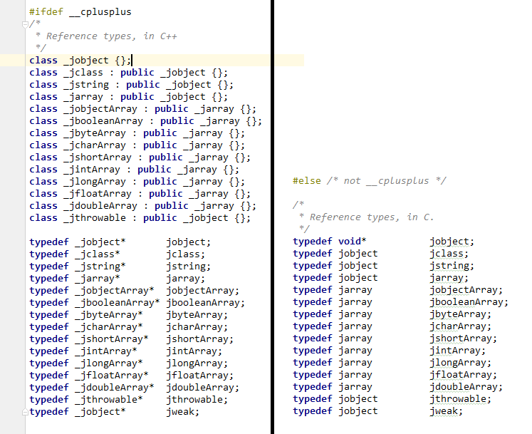

# JNI中的数据类型以及数据结构

## 概述

因为JNI是一套Native层和JVM通信的机制，通信就是信息交流，所以就必须要提供在两种语言间的数据交换的机制。基于这个原因，JNI中通过typedef定义了一套专用的数据类型以及数据结构。

## Java基本类型

|Java Type|Native Type|Description|
|---------|-----------|-----------|
|boolean| jboolean|unsigned 8 bits|
|byte|jbyte|signed 8 bits|
|char|jchar|unsigned|
|short|jshort|signed 16 bits|
|int|jint|signed 32 bits|
|long|jlong|signed 64 bits|
|float|jfloat|32 bits|
|double|jdouble|64 bits|
|void|void|not applicable|

还添加了一下定义方便使用

* `#define JNI_FALSE 0`
* `#define JNI_TRUE 1`
* `typedef jint jsize` 用于标识索引和大小(C++标准建议用尽量准确的类型符来标识一个变量。比如，表示大小就用size_t等，而不是使用在个平台都有可能产生不一致的int、short等)

## Java引用类型

JNI 中还包含了一组特殊的类型，用来对应Java中的引用类型，我们暂且称之为JNI引用类型。为了尽量和Java引用类型像照应，JNI引用类型遵照如下层次结构：

* jobject(用于引用所有Object对象)
  * jclass(用于引用Classs对象)
  * jstring(用于引用String对象)
  * jarray(数组对象)
    * jobjectArray(对象数组)
    * jbooleanArray(boolean数组，不是Boolean数组)
    * jbyteArray(byte数组)
    * jcharArray(char数组)
    * jshortArray(short数组)
    * jintArray(int数组)
    * jlongArray()
    * jfloatArray()
    * jdoubleArray()

JNI在定义这一组JNI引用类型的时候，正对C和C++分别采取了不同的定义方式。C中采用`typedef jobject jclass;`这种定义。C++因为是面向对象的，所以直接采用了类继承的方式。详见下图



> 可以看到在C中，不管是什么类型本质上都是void* 类型，而C++则是空类并且有了继承关系。可本质上并没有什么区别，使用的时候具体是什么类型仍需要用户自己去区别。

## Java字段和方法(Field/Method)

Java中的字段和方法定义为C中结构体的指针，如下：

```C++
struct _jfieldID;              /* opaque structure */
typedef struct _jfieldID *jfieldID;   /* field IDs */

struct _jmethodID;              /* opaque structure */
typedef struct _jmethodID *jmethodID; /* method IDs */
```

> jfieldID以及jmethodID后面注释了一句 "opaque structure(不透明结构)"，应该是说该结构交给JVM自己去定义。jni.h文件中还定义了JNINativeMethod类型，该类型暂时不用关注,它用于标识一个Java方法(一般在Native方法与Java方法的动态绑定时使用)。

## JNI Value类型(联合体类型)


## Java中必须暴露出来的信息

JNI是JVM和Native层沟通的桥梁，要达到JVM和Native可以相互沟通的目的，就必须实现下面两点

1. 在JVM层可以通过或简单或复杂的手段访问到Native层中的所有功能(包括但不限于C/C++方法的调用，变量值的获取等)。
2. 在Native层可以通过复杂或者简单的手段访问到JVM中所能使用的所有JVM功能(Java对象的创建，方法调用，变量值获取等)。

### Java中的基本数据类型

不论是JVM调用Native方法或是Native调用JVM方法，两个过程都涉及到参数的传递，JVM中有8中基本数据类型外加Java引用类型。针对这9种可能的方法参数，JNI针对基本数据类型以及引用类型分别提供了
